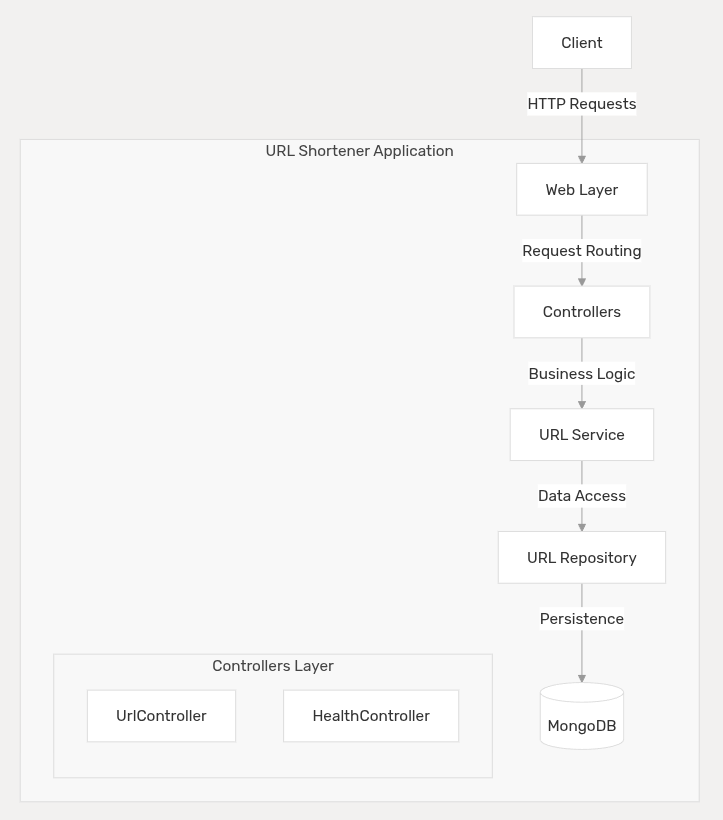

# URL Shortener in Springboot

This document provides an introduction to the URL Shortener application - a Java-based service designed to create, manage, and redirect shortened URLs. The system transforms long, unwieldy URLs into short, memorable codes that redirect to the original URL when accessed.

## Introduction

The URL Shortener is a RESTful web service developed using Java 21, Spring Boot, and MongoDB. It provides a comprehensive solution for URL shortening with support for creating, retrieving, updating, and deleting shortened URLs, as well as tracking usage statistics.

## API Overview

The application exposes REST endpoints for managing shortened URLs:

|Endpoint|Method|Description|
|---|---|---|
|`/v1/shorten`|POST|Create a shortened URL|
|`/v1/shorten/{shortCode}`|GET|Retrieve original URL|
|`/v1/shorten/{shortCode}`|PUT|Update a shortened URL|
|`/v1/shorten/{shortCode}`|DELETE|Delete a shortened URL|
|`/v1/shorten/{shortCode}/stats`|GET|Get usage statistics|
|`/v1/shorten/redirect/{shortCode}`|GET|Redirect to original URL|
|`/health`|GET|Check system health|

## High-Level Architecture
The URL Shortener follows a layered architecture pattern, with clear separation of concerns between components. The system is built using Spring Boot and follows the Model-View-Controller (MVC) architectural pattern.

